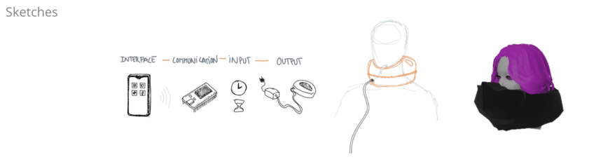
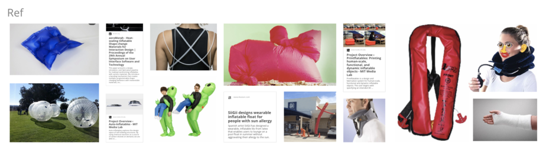
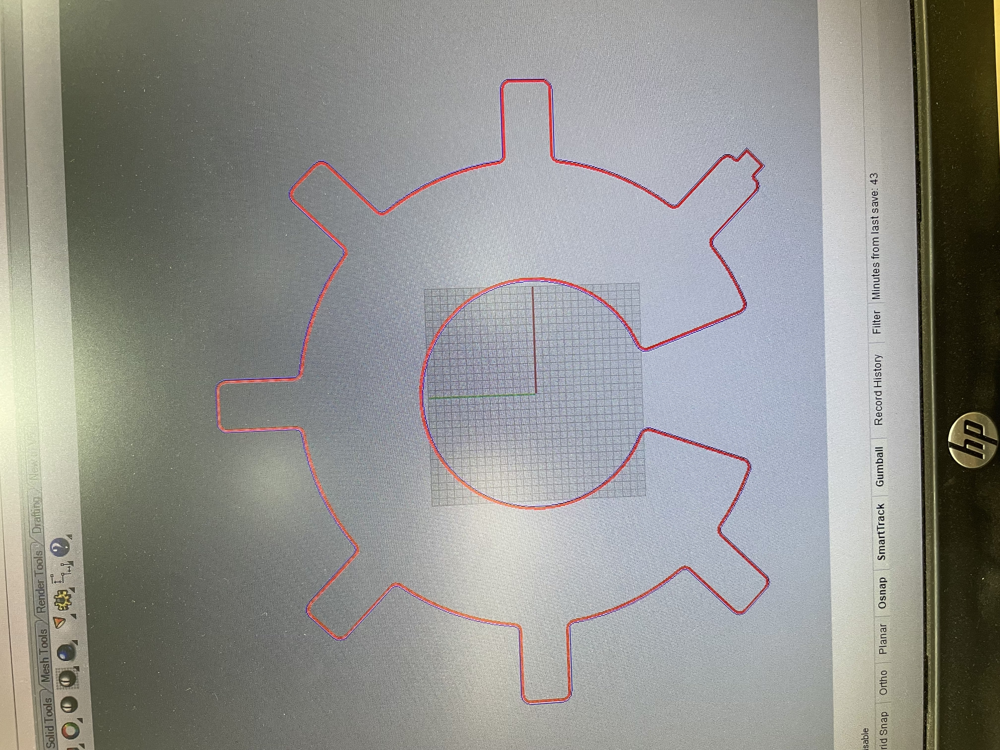
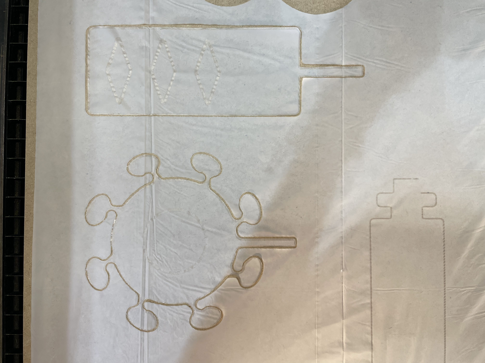
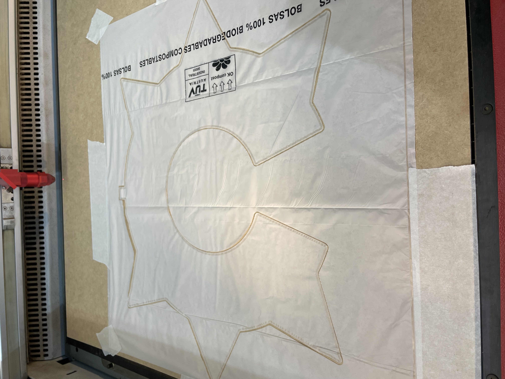
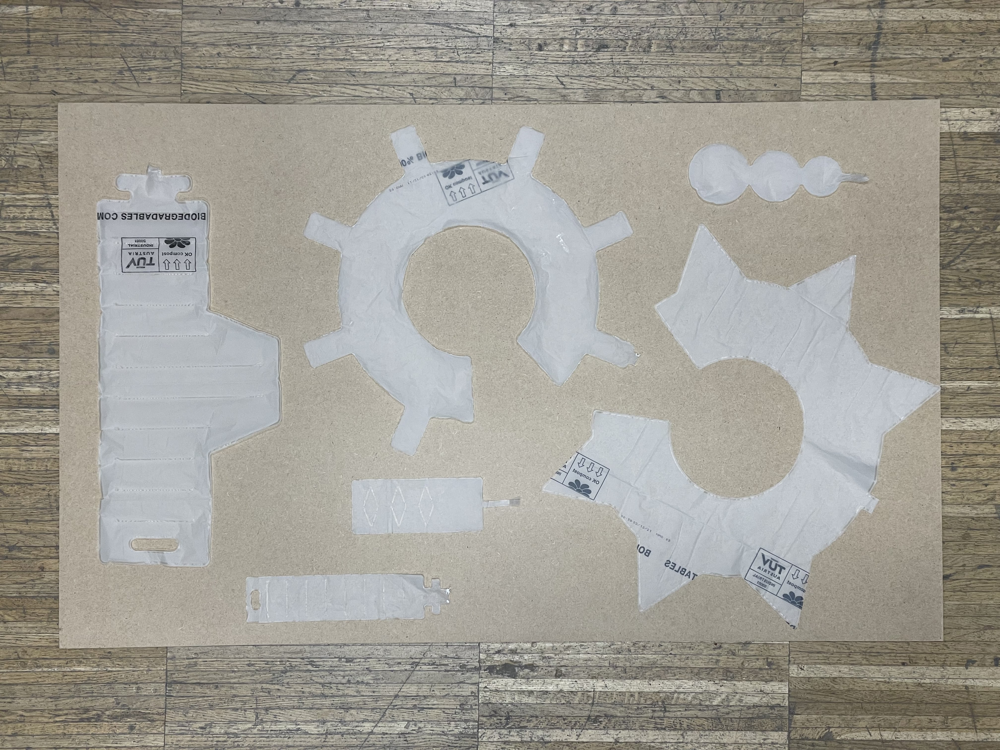
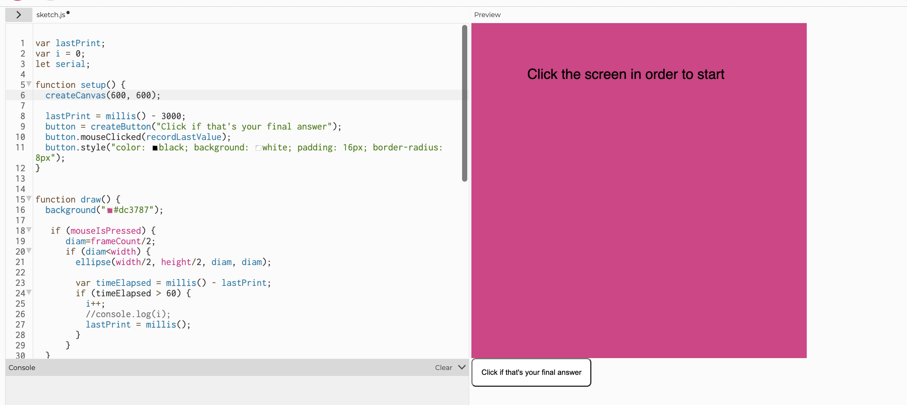
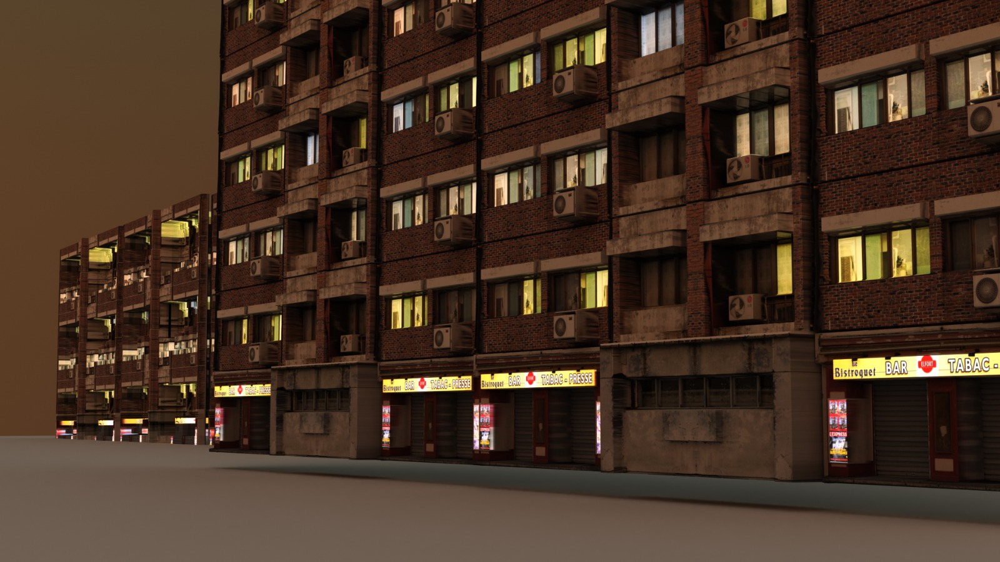

 # Fab Lab Challenge 3 : (OVER)LOAD
 *(2/05 - 6/05)*

 #### markdown syntax guide https://www.markdownguide.org/basic-syntax/#images-1

 ## What you will find in this repo
 1. Documentation for micro challenge 03
 2. Brainstorming and making process
 3. Laser cut files

 ## Project description -
 
 To create an artefact that visualises consumption of information that happens through screens. We wanted to know what happens when wearables project information outwards instead of just performing the function of data logging which is more inward and personal activity. Also we were interested in exploring What does it mean to "feel" the over load of digital information?

 ## Brainstorming
Santi created a [miro board](https://miro.com/app/board/uXjVO4T-S2o=/?share_link_id=336206314852) with venn diagrams, where we wrote down our personal areas of interest and also see the intersections happening within the members of the group.

 Didac drew a basic sketch of how we wanted the communication to happen from our phones (input) to the wearable which blows up like inflatables depending on the screen usage. We wanted the wearable to be happen live (like annotate values for each 5 minutes usage with air pump into the inflatable).

 Nikita visualised a quick version of the possible wearable. We were thinking different parts of the body which could inflate but we went with neck for further explorations as we thought it would be visually interesting and representative of the screen usage consequences. Like physiclaly restricting your body movements and also the design when inflated would prevent to see the 'real' version of you.

 ## References
  
  We choose the inflatables inspiration from MIT. It was pretty cool how they explored with different techniques 3 axis cnc mill for heat transfer with different materials (silicone, fabric). They also explored auto inflatables using carbon.

  But for us to quickly prototype with immediate things around us, Dafne showed us two previous projects which were done by fab lab and fabricademy alumni respectively.
  [first project](https://class.textile-academy.org/2022/saskia-helinska/finalproject.html)
  [second project](https://fabacademy.org/2018/labs/barcelona/students/javier-alboguijarro/week16.html)

 ## Concept Development
 - It was super interesting to see how our interests were overlapping and feeding into each others. Very early on we realised, all of us collectively wanted to explore inflatables and try 3d scanning post the process.
 - Our first step was to figure out how would we want to gather data from phone about the usage. Miguel shared a different way to gather data through any social media using [ifttt] (https://ifttt.com/). Jeremy told us we could also look into [tasker] (https://www.arduino.cc/reference/en/libraries/tasker/).
 - But for now we went with using p5.js interface and by simply tapping the interface we wanted to generate time data and carry forward that final data output as input for arduino.
 - We wanted to try using the serial control software which we had a presentation about last week and see if we could actually do it in this project.
 - We divided tasks for the next two days ( Didac worked on the prototypes and electronics, Aparna worked on the prototypes, Nikita worked on the p5js part and integration with arduino).

 ## Materials needed
 - Polythene bags (only thing to consider it should be thick enough to to hold the air pump force)
 - Valve if needed to hold the air inside the inflatable
 - Air Pump
 - Relay
 - Bread Board and Jumper Wires
 - Voltage Converter (220v to 12v)
 - ESP32
 - Plastic tube to connect inflatable with pump
 - 3D scanner

 ## Tools used
 - Arduino
 - p5.js
 - Serial Control
 - Blender
 - Rhino

 ## Prototyping
 1. For prototyping the inflatables we went with the documentation values. The worked perfectly fine to cut, but the seal was not strong enough it left out some holes:

 Sealing Previous values-
 - Power: 2.7
 - Speed: 1
 - Frequency: 1000 hz
 - z offset: 16

 Sealing Tweaked values:
 - Power: 3
 - Speed: 1
 - Frequency: 1000 hz
 - z offset: 16

 Cutting Values (they stayed the same ;) ):
 - Power: 5
 - Speed: 1
 - Frequency: 1000 hz
 - z offset: 10
2. We gave an offset of 0.5m between each seal layer in the rhino laser cut file (blue) and then 0.8m for the the cut layer (red). The order was first we let the seal layer and then the cut layer run.
 

3. After preparing the files, we had to make sure to tape in the plastic bags properly without any wrinkles as it would lead to miscalculations during the sealing part.

4. We tried playing with different sizes and inside sealing to see which which inflate better and also see it would change the form of the inflatable (like fold in any particular direction)

5. Trying out inflations by blowing in air through a straw

6. Various prototypes we tried

7. The next step was to connect the connections and write the code for arduino to pump air into the air pump. Below is the code written:-

![] (images/08.jpg)

8. Making the p5js and arduino communicate was more challenging then we expected it to be. We foolowed this guide which came in very handy to understand the concept but also to debug. [itp serial control communication]https://itp.nyu.edu/physcomp/labs/labs-serial-communication/lab-serial-input-to-the-p5-js-ide/

9. We connected the arduino tools and serial control to the same usbserial port. But we learnt that it  detects only one port at one time. So every time we changed our code in arduino and wanted to upload we had to close serial control otherwise there would be a error message.

10. The p5js interaction starts with clicking on the screen and when you leave it, the followng gets recorded as final data after you press the button that's below on the left side. The code we wrote:

11. Serial begin, serial available, serial read and serial write were for the communication between p5 and arduino.

12. Meanwhile Nikita worked on creating a 3d environment for the people walking with different inflation sizes which we 3d scanned.

 ## In Action

 ## Links to files
 - [1](laser cut files/01.3dm)
 - [2](laser cut files/02.3dm)
 - [3](laser cut files/03.3dm)
 - [4](laser cut files/04.3dm)
